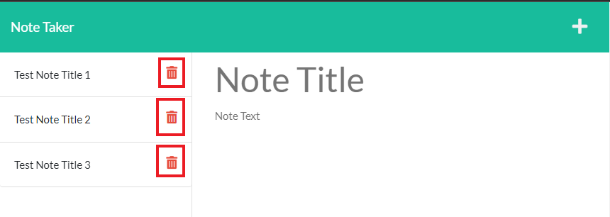

# Note Taker App
 <br/>
Welcome to my [Note Taking App](https://cagatin-note-app.herokuapp.com/) <br/>

## Table of Contents
[Description](#description) <br />
[Installation](#installation) <br />
[Contribute](#contribute) <br />
[Test](#test) <br />
[Questions](#questions) <br />
<br />

## Description
A note taker app used to write and save notes for the user. The app utilizes Express.js to retrieve note data from a JSON file. <br />

## Installation
To install this app, the user must run:
 ```$ npm install``` 
 in the command line within the root directory to install the dependencies. <br/> 
 
 To run a local version of the app, the user can run: 
 ```node server.js``` 
 
 To view the deployed version: <br/> 
 the user can go to https://cagatin-note-app.herokuapp.com/. <br/>

## Usage
To create a new note the user can either: <br/>
 <br/>
(a) Click on the + sign <br/>
(b) Begin writing in the 'Note Title' and 'Note Text' areas <br/>

To save a new note, the user can simply click the save icon as shown below: <br/>
<br/>

The Notes are then displayed on the left hand side of the screen as shown: <br/>
<br/>

To delete notes, the user can click on the red trash icon as displayed below: <br/>
 <br/>

## Contribute
To contribute to this project, fork the repository and submit a pull request with your desired changes.  <br/>

## Test
N/A <br/>

## Questions? 
Reach me at the following with your questions: <br/>
Github Username: https://github.com/cagatin <br/>
Email:  cagatingilbert@gmail.com <br/>
<br/>
[](https://opensource.org/licenses/MIT)